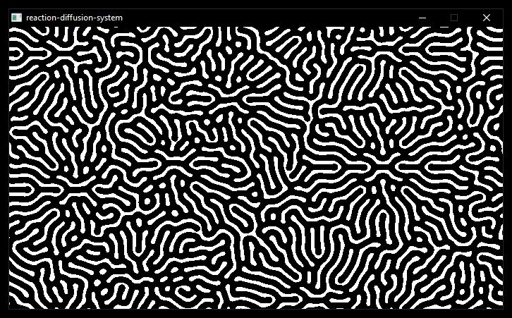

# Reaction Diffusion System

A real-time reaction-diffusion simulation built (from scratch) in C, using the Gray-Scott model, and rendered live with SDL3.

Two virtual chemicals (A and B) interact across a grid. A acts as fuel, B as a catalyst. The result is a continuous organic pattern that looks surprisingly alive for extremely simple math.



---

## Dependencies

- SDL3
- GCC or compatible C compiler

### Installing SDL3 (MSYS2/MINGW64)
```bash
pacman -S mingw-w64-x86_64-SDL3
```

### Installing SDL3 (Linux)
```bash
git clone https://github.com/libsdl-org/SDL.git -b main
cd SDL && mkdir build && cd build
cmake .. && make && sudo make install
```

---

## Build & Run
```bash
make
./reaction_diffusion
```

Close the window to exit.

---

## Tweaking Patterns

Different `FEED` and `KILL` values in `main.c` produce different patterns:

| Pattern    | FEED  | KILL  |
|------------|-------|-------|
| Labyrinth  | 0.054 | 0.062 |
| Coral      | 0.058 | 0.065 |
| Mitosis    | 0.028 | 0.053 |
| Fingerprint| 0.037 | 0.060 |
| Chaos      | 0.026 | 0.051 |

Check out `params/presets.txt` for more info.

---

## How it works

Each cell on the grid updates every frame using the Gray-Scott equations. The pattern seeds randomly on startup so every run looks different.